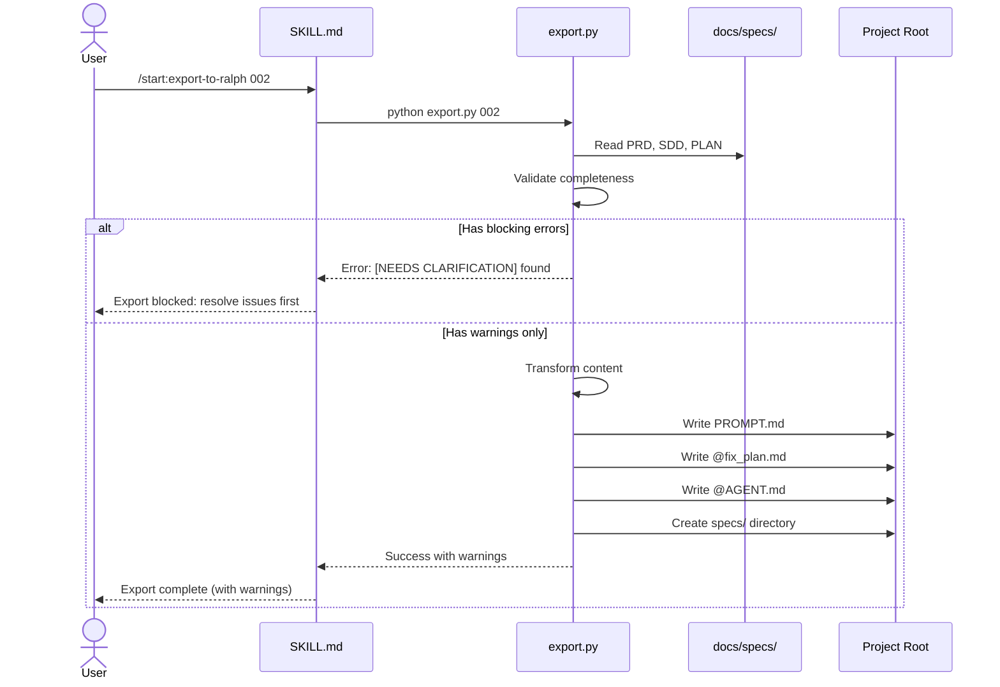

# Solution Design Document

## Validation Checklist

### CRITICAL GATES (Must Pass)

- [x] All required sections are complete
- [x] No [NEEDS CLARIFICATION] markers remain
- [x] Architecture pattern is clearly stated with rationale
- [x] **All architecture decisions confirmed by user**
- [x] Every interface has specification

### QUALITY CHECKS (Should Pass)

- [x] All context sources are listed with relevance ratings
- [x] Project commands are discovered from actual project files
- [x] Constraints → Strategy → Design → Implementation path is logical
- [x] Every component in diagram has directory mapping
- [x] Error handling covers all error types
- [x] Quality requirements are specific and measurable
- [x] Component names consistent across diagrams
- [x] A developer could implement from this design

---

## Constraints

CON-1: **Plugin Architecture** - Must follow existing skill structure pattern (SKILL.md, template.md, reference.md in dedicated directory)

CON-2: **Tool Availability** - Limited to tools available in Claude Code: Read, Write, Edit, Bash, TodoWrite, Grep, Glob, Task, AskUserQuestion

CON-3: **No External Dependencies** - Cannot require npm/pip packages; Python scripts only use standard library

CON-4: **Cross-Platform** - Must work on Windows, macOS, and Linux (Ralph uses Bash scripts)

CON-5: **Deterministic Output** - Transformation must be predictable and reproducible (no AI-mediated conversion)

CON-6: **Partial Export Support** - Must handle incomplete specifications with warnings (user-confirmed decision)

## Implementation Context

**IMPORTANT**: You MUST read and analyze ALL listed context sources to understand constraints, patterns, and existing architecture.

### Required Context Sources

#### Documentation Context
```yaml
- doc: skills/specification-management/SKILL.md
  relevance: HIGH
  why: "Reference pattern for new skill structure and directory management"

- doc: skills/requirements-analysis/template.md
  relevance: HIGH
  why: "PRD template structure - source document for PROMPT.md + @fix_plan.md"

- doc: skills/architecture-design/template.md
  relevance: HIGH
  why: "SDD template structure - source document for @AGENT.md"

- doc: skills/implementation-planning/template.md
  relevance: HIGH
  why: "PLAN template structure - source for @fix_plan.md task list"

- doc: commands/specify.md
  relevance: MEDIUM
  why: "Command pattern showing how skills are invoked in workflow"
```

#### Code Context
```yaml
- file: skills/specification-management/spec.py
  relevance: HIGH
  why: "Python script pattern for directory operations; reference for export script"

- file: .claude-plugin/plugin.json
  relevance: LOW
  why: "Plugin metadata; no modification needed for new skill"
```

#### External APIs
```yaml
- service: Ralph Claude Code
  doc: https://github.com/frankbria/ralph-claude-code
  relevance: CRITICAL
  why: "Target format requirements for PROMPT.md, @fix_plan.md, @AGENT.md, specs/"
```

### Implementation Boundaries

- **Must Preserve**: Existing skill structure; plugin.json metadata; commands/specify.md workflow
- **Can Modify**: None - this is a new skill addition
- **Must Not Touch**: Other skills' internal implementations; existing spec directories

### External Interfaces

#### System Context Diagram

```mermaid
graph TB
    User[Developer] --> SpecifyCmd[/start:specify]
    SpecifyCmd --> PRD[product-requirements.md]
    SpecifyCmd --> SDD[solution-design.md]
    SpecifyCmd --> PLAN[implementation-plan.md]

    User --> ExportCmd[/start:export-to-ralph]
    ExportCmd --> PRD
    ExportCmd --> SDD
    ExportCmd --> PLAN

    ExportCmd --> PROMPT[PROMPT.md]
    ExportCmd --> FIXPLAN[@fix_plan.md]
    ExportCmd --> AGENT[@AGENT.md]
    ExportCmd --> SPECS[specs/]

    PROMPT --> Ralph[Ralph Orchestration]
    FIXPLAN --> Ralph
    AGENT --> Ralph
    SPECS --> Ralph
```

#### Interface Specifications

```yaml
# Inbound Interfaces (what calls this skill)
inbound:
  - name: "User Command"
    type: CLI
    format: "/start:export-to-ralph [spec-id]"
    authentication: None
    doc: New command to be created
    data_flow: "Spec ID or name to export"

  - name: "Skill Invocation"
    type: Skill tool
    format: "Skill(skill: 'start:export-to-ralph')"
    authentication: None
    doc: Called from commands/specify.md finalization
    data_flow: "Spec context from specification-management"

# Outbound Interfaces (what this skill produces)
outbound:
  - name: "PROMPT.md"
    type: File
    format: Markdown
    destination: Project root
    criticality: HIGH
    doc: Ralph's main instruction file

  - name: "@fix_plan.md"
    type: File
    format: Markdown with checkboxes
    destination: Project root
    criticality: HIGH
    doc: Ralph's task list

  - name: "@AGENT.md"
    type: File
    format: Markdown with code blocks
    destination: Project root
    criticality: HIGH
    doc: Ralph's build/run configuration

  - name: "specs/"
    type: Directory
    format: Markdown files with Gherkin scenarios
    destination: Project root/specs/
    criticality: MEDIUM
    doc: Ralph's feature specifications
```

### Project Commands

```bash
# Core Commands (no additional commands needed - Python standard library only)
Test:    python -m pytest tests/  # If tests created
Lint:    python -m py_compile export.py  # Syntax check only
```

## Solution Strategy

- **Architecture Pattern**: Single-responsibility skill with Python export script
- **Integration Approach**: New skill `export-to-ralph` invoked after specification completion; reads spec documents, transforms content, writes Ralph files to project root
- **Justification**: Follows established skill pattern; Python handles file I/O and transformation logic cleanly; deterministic output ensures reproducibility
- **Key Decisions**:
  1. Python script for complex transformation logic (like spec.py pattern)
  2. Skill provides methodology/guidance; script executes transformation
  3. Export to project root for direct Ralph consumption
  4. Partial export with warnings rather than blocking

## Building Block View

### Components

```mermaid
graph LR
    User[Developer] --> Skill[SKILL.md Guidance]
    Skill --> Validator[Document Validator]
    Validator --> Transformer[Content Transformer]
    Transformer --> Writer[File Writer]

    subgraph "Input Documents"
        PRD[product-requirements.md]
        SDD[solution-design.md]
        PLAN[implementation-plan.md]
    end

    Validator --> PRD
    Validator --> SDD
    Validator --> PLAN

    subgraph "Output Files"
        PROMPT[PROMPT.md]
        FIXPLAN[@fix_plan.md]
        AGENT[@AGENT.md]
        SPECS[specs/]
    end

    Writer --> PROMPT
    Writer --> FIXPLAN
    Writer --> AGENT
    Writer --> SPECS
```

### Directory Map

**Component**: export-to-ralph skill
```
skills/
└── export-to-ralph/                    # NEW: Skill directory
    ├── SKILL.md                        # NEW: Skill definition and methodology
    ├── export.py                       # NEW: Python export script
    ├── reference.md                    # NEW: Transformation rules reference
    └── templates/                      # NEW: Ralph file templates
        ├── prompt-template.md          # NEW: PROMPT.md structure
        ├── fixplan-template.md         # NEW: @fix_plan.md structure
        └── agent-template.md           # NEW: @AGENT.md structure
```

**Output**: Project root (Ralph files)
```
project-root/
├── PROMPT.md                           # GENERATED: Main Ralph instructions
├── @fix_plan.md                        # GENERATED: Task checklist
├── @AGENT.md                           # GENERATED: Build/run config
└── specs/                              # GENERATED: Feature specifications
    ├── features/                       # GENERATED: Per-feature specs
    │   ├── [feature-1].md
    │   └── [feature-2].md
    ├── scenarios/                      # GENERATED: Test scenarios
    │   ├── error-handling.md
    │   └── edge-cases.md
    └── interfaces/                     # GENERATED: API/data specs
        └── api.md
```

### Interface Specifications

#### Data Storage Changes

No database changes - file-based only.

#### Internal API Changes

**export.py CLI Interface:**
```yaml
Endpoint: export.py
  Method: CLI
  Path: python skills/export-to-ralph/export.py [spec-id-or-path] [options]
  Arguments:
    spec: string (required) - Spec ID (e.g., "002") or full path
    --output-dir: string (optional) - Target directory (default: project root)
    --dry-run: flag (optional) - Show what would be created without writing
    --force: flag (optional) - Overwrite existing files without prompt
  Response:
    success:
      exit_code: 0
      stdout: List of created files
    error:
      exit_code: 1
      stderr: Error message with specific issue
```

#### Application Data Models

```pseudocode
ENTITY: SpecificationBundle (Input)
  FIELDS:
    spec_id: string
    spec_dir: Path
    prd_path: Path (optional)
    sdd_path: Path (optional)
    plan_path: Path (optional)

  BEHAVIORS:
    validate(): ValidationResult
    is_complete(): boolean
    get_warnings(): List[string]

ENTITY: TransformationResult (Output)
  FIELDS:
    prompt_content: string
    fixplan_content: string
    agent_content: string
    specs_files: Dict[string, string]
    warnings: List[string]

  BEHAVIORS:
    write_all(output_dir: Path): void
    has_warnings(): boolean

ENTITY: ValidationResult
  FIELDS:
    valid: boolean
    blocking_errors: List[string]
    warnings: List[string]

  BEHAVIORS:
    can_proceed(): boolean
```

#### Integration Points

```yaml
# Inter-Component Communication
- from: SKILL.md
  to: export.py
    - protocol: Bash execution
    - endpoints: CLI arguments
    - data_flow: "Skill invokes script with spec ID; script returns success/failure"

- from: export.py
  to: Specification files
    - protocol: File read
    - endpoints: docs/specs/[id]-[name]/*.md
    - data_flow: "Read PRD, SDD, PLAN documents"

- from: export.py
  to: Ralph output files
    - protocol: File write
    - endpoints: PROMPT.md, @fix_plan.md, @AGENT.md, specs/
    - data_flow: "Write transformed content"
```

### Implementation Examples

#### Example: EARS to Gherkin Transformation

**Why this example**: This is the most complex transformation, converting EARS-format acceptance criteria to Gherkin scenarios.

```python
def transform_ears_to_gherkin(ears_criterion: str) -> str:
    """
    Transform EARS-format acceptance criteria to Gherkin scenario.

    EARS patterns:
    - UBIQUITOUS: "THE SYSTEM SHALL X"
    - EVENT-DRIVEN: "WHEN X, THE SYSTEM SHALL Y"
    - STATE-DRIVEN: "WHILE X, THE SYSTEM SHALL Y"
    - OPTIONAL: "WHERE X, THE SYSTEM SHALL Y"
    - COMPLEX: "IF X, THEN THE SYSTEM SHALL Y"
    """
    import re

    # EVENT-DRIVEN: WHEN X, THE SYSTEM SHALL Y
    match = re.match(r'WHEN (.+?), THE SYSTEM SHALL (.+)', ears_criterion, re.IGNORECASE)
    if match:
        trigger, action = match.groups()
        return f"Given the system is ready\nWhen {trigger.lower()}\nThen the system {action.lower()}"

    # COMPLEX: IF X, THEN THE SYSTEM SHALL Y
    match = re.match(r'IF (.+?), THEN THE SYSTEM SHALL (.+)', ears_criterion, re.IGNORECASE)
    if match:
        condition, action = match.groups()
        return f"Given {condition.lower()}\nWhen the operation is triggered\nThen the system {action.lower()}"

    # UBIQUITOUS: THE SYSTEM SHALL X
    match = re.match(r'THE SYSTEM SHALL (.+)', ears_criterion, re.IGNORECASE)
    if match:
        action = match.group(1)
        return f"Then the system {action.lower()}"

    # Fallback: return as-is with comment
    return f"# TODO: Convert manually\n# Original: {ears_criterion}"
```

#### Example: PLAN Task Flattening

**Why this example**: Shows how TDD-structured tasks become simple checkbox items.

```python
def flatten_plan_task(task_block: str) -> str:
    """
    Transform PLAN task with TDD structure to @fix_plan.md checkbox.

    Input:
    - [ ] **T1.1 Payment Entity** `[activity: domain-modeling]`
      Prime: Read payment interface contracts
      Test: Validation for negative amounts
      Implement: Create src/domain/Payment.ts
      Validate: Unit tests pass
      Success: Works correctly [ref: PRD/AC-1.1]

    Output:
    - [ ] T1.1: Create Payment entity with negative amount validation (src/domain/Payment.ts) [ref: PRD/AC-1.1]
    """
    import re

    # Extract task ID and name
    id_match = re.search(r'\*\*(T\d+\.\d+)\s+(.+?)\*\*', task_block)
    task_id = id_match.group(1) if id_match else "T?.?"
    task_name = id_match.group(2) if id_match else "Unknown"

    # Extract Implement line for file path
    impl_match = re.search(r'Implement:\s*(.+?)(?:\n|$)', task_block)
    impl_detail = impl_match.group(1).strip() if impl_match else ""

    # Extract file path from implementation
    file_match = re.search(r'`([^`]+)`|Create\s+(\S+)', impl_detail)
    file_path = (file_match.group(1) or file_match.group(2)) if file_match else ""

    # Extract Test line for key behavior
    test_match = re.search(r'Test:\s*(.+?)(?:\n|$)', task_block)
    test_desc = test_match.group(1).strip() if test_match else ""

    # Extract PRD reference
    ref_match = re.search(r'\[ref:\s*(PRD/AC-[\d.]+)\]', task_block)
    prd_ref = f" [ref: {ref_match.group(1)}]" if ref_match else ""

    # Build concise description
    file_note = f" ({file_path})" if file_path else ""
    behavior_note = f" with {test_desc}" if test_desc else ""

    return f"- [ ] {task_id}: {task_name}{behavior_note}{file_note}{prd_ref}"
```

## Runtime View

### Primary Flow

#### Primary Flow: Export Specification to Ralph Format

1. User runs `/start:export-to-ralph 002` or `Skill(skill: "start:export-to-ralph")`
2. Skill loads SKILL.md methodology and prompts for spec ID if not provided
3. Script validates spec directory exists and has required documents
4. Script reads PRD, SDD, PLAN (if available)
5. Script checks for [NEEDS CLARIFICATION] markers (blocking)
6. Script transforms content using mapping rules
7. Script writes PROMPT.md, @fix_plan.md, @AGENT.md, specs/ to project root
8. Skill reports success with file list and any warnings



### Error Handling

| Error Type | Detection | Response |
|------------|-----------|----------|
| **Spec not found** | Spec ID doesn't exist | Exit with error: "Spec [ID] not found in docs/specs/" |
| **[NEEDS CLARIFICATION] markers** | Regex search in documents | Exit with error: "Cannot export - resolve clarification markers first" + list markers |
| **Missing PRD** | File not exists | Warning: "PRD not found - PROMPT.md will lack context" |
| **Missing SDD** | File not exists | Warning: "SDD not found - @AGENT.md will have minimal config" |
| **Missing PLAN** | File not exists | Warning: "PLAN not found - @fix_plan.md will only have PRD features" |
| **Missing Must-Have features** | No features extracted | Exit with error: "No Must-Have features found - cannot generate task list" |
| **Output collision** | Files exist at target | Prompt: "Files exist. Overwrite? (use --force to skip)" |
| **Write permission denied** | OS permission error | Exit with error: "Cannot write to [path]: Permission denied" |

### Complex Logic

```
ALGORITHM: Export Specification to Ralph Format
INPUT: spec_id, output_dir (optional)
OUTPUT: Ralph files (PROMPT.md, @fix_plan.md, @AGENT.md, specs/)

1. RESOLVE_SPEC_PATH:
   - If spec_id is 3 digits: Find docs/specs/[id]-*/ directory
   - If spec_id is path: Use directly
   - If not found: ERROR "Spec not found"

2. VALIDATE_DOCUMENTS:
   - Check for [NEEDS CLARIFICATION] in all documents
   - If found: BLOCKING_ERROR with marker locations
   - Check required fields (PRD Must-Have, SDD Commands, PLAN Phase 1)
   - If missing critical: BLOCKING_ERROR
   - If missing recommended: Add to warnings

3. READ_DOCUMENTS:
   - prd_content = read PRD if exists
   - sdd_content = read SDD if exists
   - plan_content = read PLAN if exists

4. TRANSFORM_PROMPT:
   - Extract PRD.Vision → Overview
   - Extract PRD.Problem → Problem & Context
   - Extract PRD.ValueProp → Objectives
   - Extract PRD.WontHave + SDD.Boundaries → Scope Boundaries
   - Merge PRD.Constraints + SDD.Constraints → Key Constraints
   - Extract PRD.Assumptions → Assumptions
   - Extract PRD.KPIs → Success Criteria
   - Append RALPH_STATUS template block

5. TRANSFORM_FIXPLAN:
   - If PLAN exists:
     - Extract Phase 1 tasks → High Priority
     - Extract Phase 2 tasks → Medium Priority
     - Extract Phase 3 tasks → Low Priority
     - Flatten each task using task_flattening rules
     - Preserve [ref:] tags
     - Add parallelization notes for [parallel: true] tasks
   - Else if PRD exists:
     - Extract Must-Have features → High Priority
     - Extract Should-Have features → Medium Priority
     - Extract Could-Have features → Low Priority
   - Add Notes section with traceability info

6. TRANSFORM_AGENT:
   - Extract SDD.ProjectCommands → Install/Dev/Test/Build sections
   - Extract SDD.SolutionStrategy → Architecture Pattern
   - Extract SDD.DirectoryMap → Key Files
   - Extract SDD.IntegrationPoints → Integration Points
   - Extract SDD.QualityRequirements → Quality Requirements
   - Extract SDD.ADRs → Decision Rationale (name + rationale only)
   - Extract SDD.ErrorHandling → Error Handling Approach

7. TRANSFORM_SPECS:
   - For each PRD feature:
     - Create features/[feature-name].md
     - Transform EARS criteria to Gherkin scenarios
     - Include user story and business rules
   - If SDD has error handling:
     - Create scenarios/error-handling.md with error scenarios
   - If PRD has edge cases:
     - Create scenarios/edge-cases.md with edge case scenarios
   - If SDD has API specs:
     - Create interfaces/api.md with endpoint documentation

8. WRITE_OUTPUT:
   - If not --dry-run:
     - Check for existing files
     - If exists and not --force: Prompt user
     - Write PROMPT.md
     - Write @fix_plan.md
     - Write @AGENT.md
     - Create specs/ directory and write files
   - Return list of created/modified files

9. REPORT:
   - List all files created
   - List any warnings
   - Suggest next step: "Run `ralph start` to begin autonomous implementation"
```

## Deployment View

No change to existing deployment - skill is file-based addition.

### Single Application Deployment
- **Environment**: Plugin directory (skills/export-to-ralph/)
- **Configuration**: None required
- **Dependencies**: Python 3.x (standard library only)
- **Performance**: Expected < 1 second for typical spec size

## Cross-Cutting Concepts

### Pattern Documentation

```yaml
# Existing patterns used in this feature
- pattern: skills/specification-management/SKILL.md
  relevance: HIGH
  why: "Reference skill structure pattern for new skill"

- pattern: skills/specification-management/spec.py
  relevance: HIGH
  why: "Reference Python script pattern for export.py"

# New patterns created for this feature
- pattern: skills/export-to-ralph/reference.md (NEW)
  relevance: HIGH
  why: "Documents transformation rules for specification → Ralph format"
```

### System-Wide Patterns

- **Security**: No security concerns - local file operations only
- **Error Handling**: Fail-fast for blocking errors; continue with warnings for non-critical
- **Performance**: No performance concerns for file transformation
- **Logging**: Use stdout/stderr for CLI feedback

## Architecture Decisions

- [x] **ADR-1 Python Script for Transformation**: Use Python script (export.py) for complex transformation logic
  - Rationale: Follows spec.py pattern; Python handles regex and file I/O cleanly; deterministic output
  - Trade-offs: Requires Python installed (already required for existing skills)
  - User confirmed: **Yes (2026-01-18)**

- [x] **ADR-2 Export to Project Root**: Write Ralph files to project root by default
  - Rationale: User decision - simplest integration with Ralph workflow; Ralph expects files in project root
  - Trade-offs: May conflict with existing files; requires overwrite confirmation
  - User confirmed: **Yes (2026-01-18)**

- [x] **ADR-3 Partial Export with Warnings**: Allow export when optional sections missing
  - Rationale: User decision - enables iterative workflow; doesn't block on non-critical gaps
  - Trade-offs: May produce incomplete Ralph configuration; relies on user reading warnings
  - User confirmed: **Yes (2026-01-18)**

- [x] **ADR-4 Deterministic Transformation**: Use regex-based transformation, not AI-mediated
  - Rationale: Reproducible output; faster execution; no API calls needed
  - Trade-offs: May not handle edge cases in document structure; requires manual fallback
  - User confirmed: **Yes (2026-01-18)**

- [x] **ADR-5 SKILL.md + Python Script Architecture**: Skill provides methodology; script executes
  - Rationale: Follows established pattern; separation of concerns; reusable script
  - Trade-offs: Two files to maintain; script must be invoked via Bash
  - User confirmed: **Yes (2026-01-18)**

## Quality Requirements

| Requirement | Metric | Target |
|-------------|--------|--------|
| **Transformation Accuracy** | Fields correctly mapped | 100% for documented fields |
| **Execution Time** | Time to export | < 2 seconds for typical spec |
| **Error Detection** | [NEEDS CLARIFICATION] markers caught | 100% detection rate |
| **Cross-Platform** | Works on Windows/macOS/Linux | All three platforms |
| **Partial Export** | Handles missing optional sections | No crashes; clear warnings |

## Acceptance Scenarios

**Scenario: PRD/AC-1.1 - Complete specification export**
```gherkin
Given: A completed specification 002-ralph-claude-code-integration
And: PRD, SDD, and PLAN documents exist without [NEEDS CLARIFICATION] markers
When: User runs /start:export-to-ralph 002
Then: System creates PROMPT.md with vision, problem, objectives
And: System creates @fix_plan.md with prioritized task list
And: System creates @AGENT.md with build commands
And: System creates specs/ directory with feature files
And: System displays list of created files
```

**Scenario: PRD/AC-1.2 - Blocked export due to incomplete specification**
```gherkin
Given: A specification with [NEEDS CLARIFICATION] markers in PRD
When: User runs /start:export-to-ralph 002
Then: System displays error "Cannot export - resolve clarification markers first"
And: System lists locations of all markers
And: No files are created
```

**Scenario: PRD/AC-1.3 - Partial export with warnings**
```gherkin
Given: A specification with completed PRD but missing SDD
When: User runs /start:export-to-ralph 002
Then: System creates PROMPT.md from PRD content
And: System creates @fix_plan.md from PRD features
And: System creates minimal @AGENT.md with TODO placeholders
And: System displays warning "SDD not found - @AGENT.md will have minimal config"
```

**Scenario: PRD/AC-2.1 - PLAN task flattening**
```gherkin
Given: A PLAN with TDD-structured tasks (Prime/Test/Implement/Validate)
When: Export transforms PLAN to @fix_plan.md
Then: Each task becomes single checkbox item
And: File paths are preserved in parentheses
And: PRD references are preserved as [ref: PRD/AC-X.Y]
```

**Scenario: PRD/AC-3.1 - EARS to Gherkin conversion**
```gherkin
Given: PRD acceptance criteria in EARS format
When: Export transforms to specs/ feature files
Then: EVENT-DRIVEN criteria become Given-When-Then scenarios
And: UBIQUITOUS criteria become Then statements
And: COMPLEX criteria become Given-Then scenarios
And: Original EARS text is preserved as comment
```

## Risks and Technical Debt

### Known Technical Issues
- No known issues (new implementation)

### Technical Debt
- None introduced (clean-slate implementation)

### Implementation Gotchas
- **Windows path handling**: Use Path objects, not string concatenation
- **File encoding**: Always use UTF-8 for reading/writing Markdown
- **YAML in Markdown**: SDD uses YAML code blocks; must parse carefully
- **Checkbox detection**: PLAN uses `- [ ]` format; regex must handle variations
- **EARS pattern matching**: Regex must be case-insensitive and handle line breaks

## Glossary

### Domain Terms

| Term | Definition | Context |
|------|------------|---------|
| Ralph | Autonomous AI development loop system | Target system for exported files |
| EARS | Easy Approach to Requirements Syntax | Format for acceptance criteria in PRD |
| Gherkin | Given-When-Then scenario format | Format for scenarios in Ralph specs/ |

### Technical Terms

| Term | Definition | Context |
|------|------------|---------|
| Skill | Self-contained workflow module in this plugin | Directory under skills/ |
| SKILL.md | Skill definition file with frontmatter | Defines skill activation and methodology |
| TDD | Test-Driven Development | Prime/Test/Implement/Validate structure in PLAN |

### API/Interface Terms

| Term | Definition | Context |
|------|------------|---------|
| @fix_plan.md | Ralph's task checklist file | Prefix @ indicates Ralph control file |
| RALPH_STATUS | Status block in Claude responses | Required at end of PROMPT.md for Ralph runtime |
